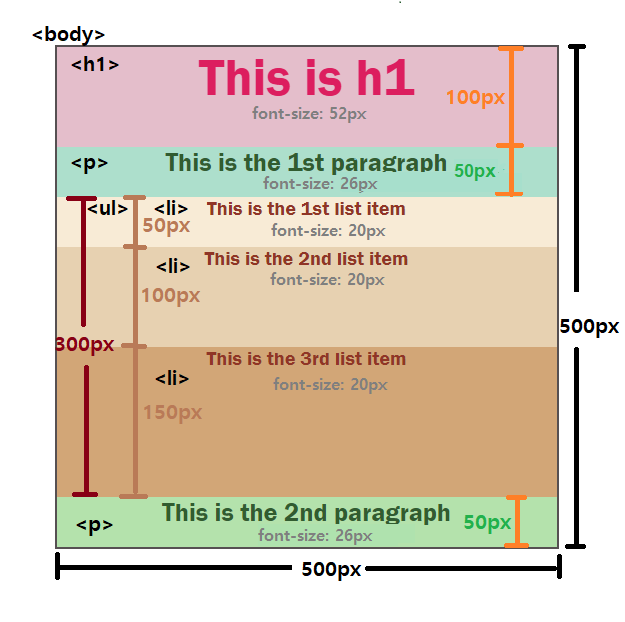

# CSS-Einheiten ändern
Ändere die absoluten Einheiten zu relativen Einheiten!

## Was du tun wirst

Das Referenzlayout (siehe unten) ist ausschließlich mit `px` gestaltet. In dieser Übung werden wir die Längeneinheiten der einzelnen Elemente ändern, indem wir `em`, `rem`, `vw`, `vh` und `%` verwenden.

### Sieh dir die Breite, Höhe und Schriftgröße der Elemente an:

## Aufgaben

Jetzt wandeln wir alle "px" in relative Einheiten um. Bitte beachte, dass die Größen gleich bleiben sollten wie im Referenzbild.

### Ersteinrichtung
Standardmäßig ist die Basisschriftgröße auf __16px__ eingestellt. Bitte ändere sie auf __10px__, bevor du mit den folgenden Aufgaben beginnst.

### Aufgabe 1
Gib `html` __100%__ der Ansichtsbreite und der Ansichtshöhe, indem du `vw` und `vh` benutzt

### Aufgabe 2
Ändere die Einheiten von `body`:
- Benutze `rem` für Höhe und Breite

### Aufgabe 3
Ändere die Einheiten von "h1":
- benutze `rem` für Höhe und Schriftgröße

### Aufgabe 4
Ändere die Einheiten von "p":
- benutze `%` für die Höhe
- verwende `rem` für die Schriftgröße
  
### Aufgabe 5
Ändere die Einheiten von `ul` und `li`:
- benutze `rem` für die Höhe von `ul`
- verwende "em" für die Höhe und die Schriftgröße von "li".
  
## Hinweise
- [MDN Docs](https://developer.mozilla.org/en-US/docs/Learn/CSS/Building_blocks/Values_and_units)
- [Nützliche Website](https://elementor.com/help/whats-the-difference-between-px-em-rem-vw-and-vh/)
